# Google-Data-Analytics-Case-Study: How Does A Bike-Share Navigate Speedy Success (With R and Tableau)

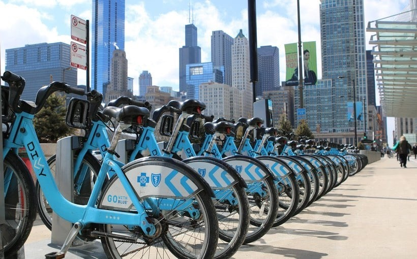

After completing the , I am now ready to tackle a case study provided by Google. I will use real-world data to perform a task as a junior data analyst for a fictional company, Cyclistic. The case study involves the company's data on its customers' trip details over a 12-month period (Jan 2022 – Dec 2022). I will follow Google’s six steps of the Data Analysis Process: Ask, Prepare, Process, Analyze, Share, and Act. For this project, I will use R and Tableau for my analysis.

## Background of the case study

### About the company

Cyclists is a fictional bike-sharing company in Chicago. It offers more than 5,800 bicycles and 600 docking stations throughout the city.

Cyclistic offers flexible pricing plans, including single-ride passes, full-day passes, and annual memberships. Casual riders, who purchase single-ride or full-day passes, makeup one segment, while Cyclistic members are those who have purchased annual memberships. Financial analysis indicates that annual members are more profitable than casual riders, leading Cyclistic to prioritize converting casual riders into members for future growth.

The director of the marketing team and manager, Lily Moreno, believes that maximizing the number of annual members will be key to future growth.

### Scenario

As a junior data analyst on Moreno's team, I was tasked with digging into the company’s historical bike trips to identify trends and help design marketing strategies to convert casual riders into annual members.

# STEP 1: Ask Phase

## Business Task

Design marketing strategies aimed at converting casual riders into annual members.

## Business Questions

-   How do annual members and casual riders use Cyclistic bikes differently?
-   Why would casual riders buy Cyclistic annual memberships?
-   How can Cyclistic use digital media to influence casual riders to become members?

As a junior data analyst at Cyclistic, I have been tasked with the first objective: How do annual members and casual riders differ?

## Key Stakeholders

1.  Lily Moreno — Director of the marketing team and my manager.
2.  Cyclistic executive team
3.  Cyclistic marketing analytics team

# STEP 2: Prepare Phase

## Data Location

The data is provided by Motivate International Inc. has made this data available under this . There are 12 monthly CSV files. I will use the historical data trips from January 2022 to December 2022. After downloading the datasets from the designated website, I will organize them (.csv format) into a dedicated folder named “Cyclistic_data”

## Bias and Credibility

### ROCCC check

-   Reliable? Yes. The data is from a reliable public data source.

-   Original? Yes. It is fictitious data that is to be used for case studies.

-   Comprehensive? Yes, the data is continuously updated monthly. I will focus on data for the 12 months of 2022.

-   Current? Yes. The data files are current.

-   Cited? Yes. The data is from Motivate, and there is a license agreement.

So, yes, the data ROCCCs.

### Licensing, Privacy, Security, Accessibility

-   Licensing: The license agreement is available online.

-   Security: Data security issues are stated in the license agreement under Prohibited Conduct.

-   Accessibility: The data is accessible online for download at Amazonws.com.

## Data Integrity:

The files have been downloaded and populated. I checked the file properties of all the files to check for byte size. All the files have the same number of columns and the same names. Problems include missing data and zero values. The missing data is predominantly station names and station IDs. Omitting the columns won’t impact the case study.

-   Completeness: there are missing values in several columns.

-   Accuracy: aside from the missing data, the data is accurate.

-   Consistency: aside from the missing values, the data is consistent.

-   Timeliness: the data is always available, so it is timely.

-   Compliance: This is a nonissue as it is a case problem.

## Organize and Protect Data

Each of the 12 data files will be saved with a new name, which preserves the original files. The new files, working files, will be used for analysis. I will then back up the original and working files.

# STEP 3: Process Phase

For this analysis, I will work with the January to December 2022 data. I will be using R programming language and Tableau for my analysis and visualizations.

## Importing the dataset
### Step 1: Import Required Libraries

```{r Import necessary libraries}
library(tidyverse) #for data wrangling and visualizations.
library(lubridate) #for dates and times functions.
library(dplyr)     #for data manipulation.
library(janitor)   #for examining and cleaning dirty data
library(skimr)     #for providing summary statistics about variables in data frames.
library(ggplot2)  #helps visualize data
```
### Step 2: Import All CSV Files
```{r Import the data}
df1<- read.csv("C:/Users/ADMIN/Desktop/Capstone Project/202201-divvy-tripdata.csv")
df2<- read.csv("C:/Users/ADMIN/Desktop/Capstone Project/202202-divvy-tripdata.csv")
df3<- read.csv("C:/Users/ADMIN/Desktop/Capstone Project/202203-divvy-tripdata.csv")
df4<- read.csv("C:/Users/ADMIN/Desktop/Capstone Project/202204-divvy-tripdata.csv")
df5<- read.csv("C:/Users/ADMIN/Desktop/Capstone Project/202205-divvy-tripdata.csv")
df6<- read.csv("C:/Users/ADMIN/Desktop/Capstone Project/202206-divvy-tripdata.csv")
df7<- read.csv("C:/Users/ADMIN/Desktop/Capstone Project/202207-divvy-tripdata.csv")
df8<- read.csv("C:/Users/ADMIN/Desktop/Capstone Project/202208-divvy-tripdata.csv")
df9<- read.csv("C:/Users/ADMIN/Desktop/Capstone Project/202209-divvy-tripdata.csv")
df10<- read.csv("C:/Users/ADMIN/Desktop/Capstone Project/202210-divvy-tripdata.csv")
df11<- read.csv("C:/Users/ADMIN/Desktop/Capstone Project/202211-divvy-tripdata.csv")
df12<- read.csv("C:/Users/ADMIN/Desktop/Capstone Project/202212-divvy-tripdata.csv")
```
### Step3: Inspecting and combining the datasets

Combine the datasets to one dataframe

```{r Combine all data frames into one}
combined_df <- bind_rows(df1, df2, df3, df4, df5, df6, df7, df8, df9, df10, df11, df12)
glimpse(combined_df)
head(combined_df)
```
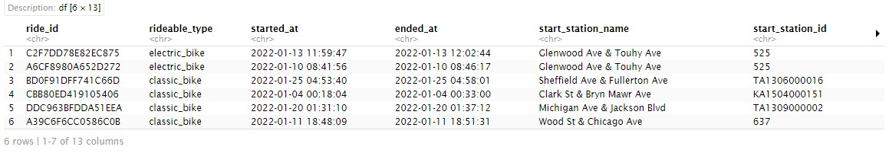

Description of the dataset

The data has 5,667,717 rows and 13 columns including:

-   rideable_type. The column has two types of bikes: electric and classic bikes.

-   started_at. The time the ride started.

-   ended_at. The time the ride ended.

-   start_station_name. The name of the station the ride started from.

-   end_station_name. The name of the station the ride ended at.

-   member_casual. Consists of two categories of rider type: member and casual

## Cleaning & Formatting the Data
Removing the columns we do not need "start_lat", "start_lng", "end_lat", "end_lng"

```{r}
Cyclistic_data <- subset(Cyclistic_data, select = -c(start_lat, start_lng, end_lat, end_lng))
```

The 'start_time' and 'end_time' columns have to be changed to datetime format

```{r datetime format}
Cyclistic_data$start_time <- as.POSIXct(Cyclistic_data$start_time, format = "%Y-%m-%d %H:%M:%S")
Cyclistic_data$end_time <- as.POSIXct(Cyclistic_data$end_time, format = "%Y-%m-%d %H:%M:%S")
```
Adding more columns to list the day, month, day, year and day of the week of the ride.

```{r Default R format is yyyy_mm_dd}
Cyclistic_data$date <- 
  as.Date(Cyclistic_data$start_time) 
```

```{r adds a 'month' column}
Cyclistic_data$month <- 
  format(as.Date(Cyclistic_data$date), "%m")
```

```{r adds a 'day' column}
Cyclistic_data$month <- 
  format(as.Date(Cyclistic_data$date), "%d")
```

```{r adds a 'year' column}
Cyclistic_data$year <- 
  format(as.Date(Cyclistic_data$date), "%Y")
```

```{r adds a 'day of the week' column}
Cyclistic_data$day_of_the_week <- 
  format(as.Date(Cyclistic_data$date), "%A")
```

```{r Rearranges the days of the week column in an orderly format}
Cyclistic_data$day_of_the_week <- ordered(Cyclistic_data$day_of_the_week,
  levels=c("Sunday", "Monday","Tuesday", "Wednesday","Thursday", "Friday", "Saturday"))
```

```{r}
str(Cyclistic_data)
```

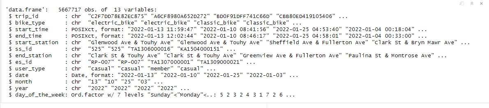

# STEP 4: Analyze Phase

### Adding a column of the ride length

```{r Calculate ride length in seconds}
Cyclistic_data$ride_length <- as.numeric(difftime(Cyclistic_data$end_time, Cyclistic_data$start_time, units = "secs"))
```
```{r The ride_length column has some extreme values. Lets assume a ride cannot take more than 24 hours (86,400 seconds), hence we need to remove these values}
# Filter out rows where ride_length is greater than 84600
Cyclistic_data2 <- Cyclistic_data2 %>%
  filter(ride_length <= 84600)
```
## Descriptive analysis on ride_length (in seconds)
```{r Mean of ride_length}
summary(Cyclistic_data2$ride_length)
```
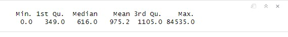

## Key Insights from the Analyze Phase
1. Ride Duration:
- Casual riders average longer ride durations (1,309.8 seconds) compared to members (743.5 seconds).
- The highest ride durations are observed during weekends, particularly for casual riders.
2. Bike Preferences:
- Casual riders frequently use docked bikes, with the longest average ride duration (2,947.98 seconds).
- Members primarily prefer electric and classic bikes, with docked bike usage being minimal.
3. Day of the Week Usage:
- Casual riders show the highest ride activity on weekends, aligning with leisure usage patterns.
- Members have consistent usage patterns across weekdays and weekends, indicating a mix of commuting and leisure use.
4. Popular Stations:
- Casual riders prefer stations near tourist and recreational areas (e.g., Streeter Dr & Grand Ave, Millennium Park).
- Members often start and end their rides at stations near residential and commercial hubs (e.g., Kingsbury St & Kinzie St, Clark St & Elm St).
5. Frequency and Patterns:
- Casual riders use the service sporadically and in longer bursts.
- Members exhibit regular usage with shorter ride durations, emphasizing commuting needs.

# STEP 5: Share Phase

I used Tableau for this phase to create visualizations.

## Members vs casual riders (average ride length)

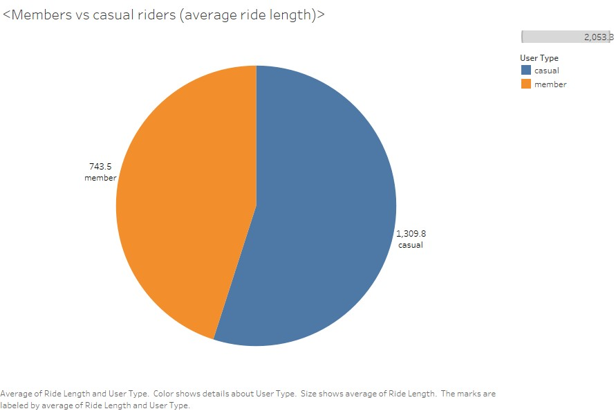

The average ride length for members is 743.5 and 1309.8 for casual riders, as shown in fig.1 above. This shows that casual riders had the longest rides compared to member riders.

## Average Ride Length by Bike Type

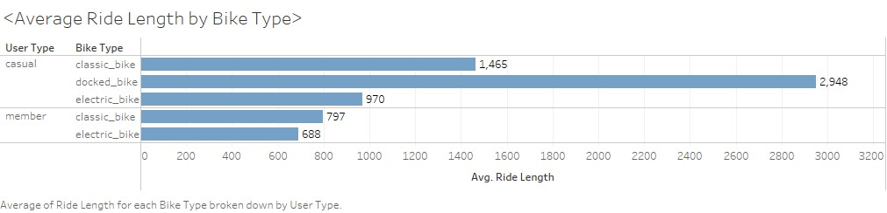

As shown by figure 2, on average, casual riders who used docked bikes had the longest rides whereas annual members did not use the docked bikes at all.

## Average Ride Length by Day of the Week

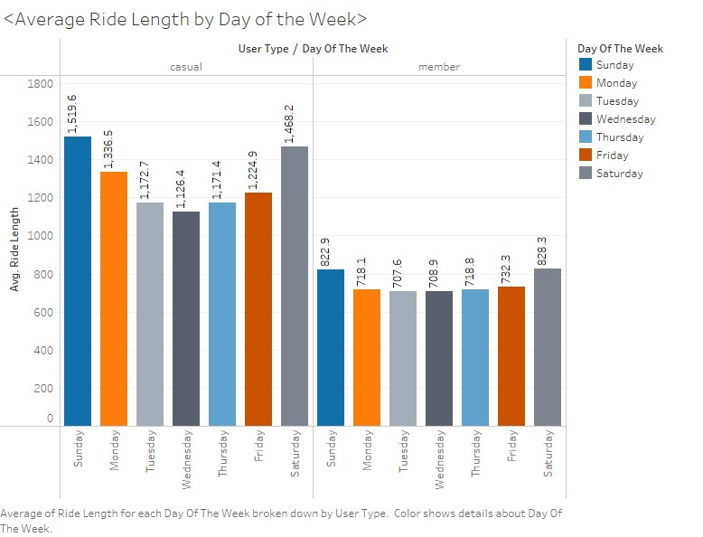

On average, casual riders ride bikes for longer periods every day of the week compared to riders with annual memberships as shown in figure 3 above. Weekends have the longest travelled distance by both casual riders and annual members.

## Average Ride Length by Bike Type by Day of the Week

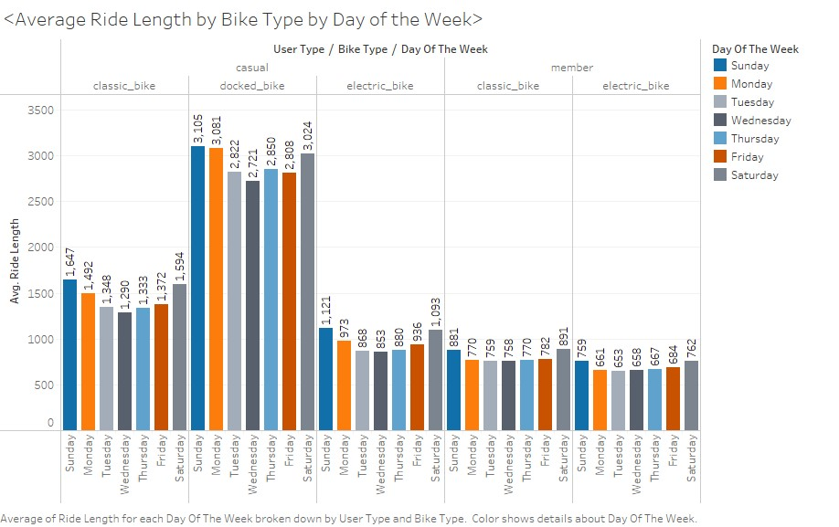

From Fig. 4 above the average ride length for all bike types was on weekends for both casual riders and annual members. For docked bikes, the highest average ride length for casual riders was on Sunday.

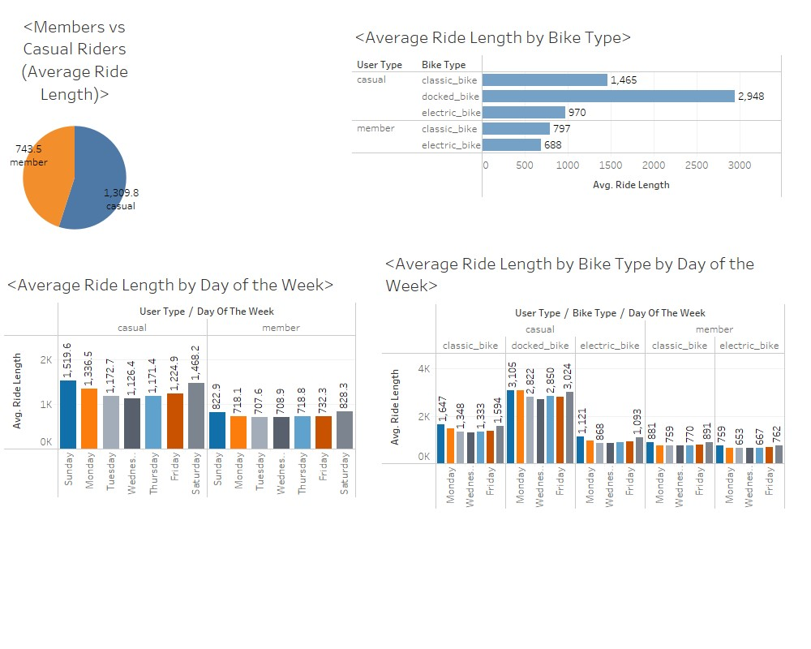

# STEP 6: Act Phase

# Recommendations

### Key Summaries

1.  Total Number of Rides

    The data reveals significant differences in usage patterns between casual riders and members, indicating that casual riders constitute a substantial portion of total rides.

2.  Average Ride Length

    Casual riders exhibit longer average ride durations compared to members. Specifically, the average ride length for casual riders was 1,309.8 seconds, whereas members averaged 743.5 seconds per ride.

## Top 5 Frequently Used Stations

### 1. Casual Riders

#### Start station names: 
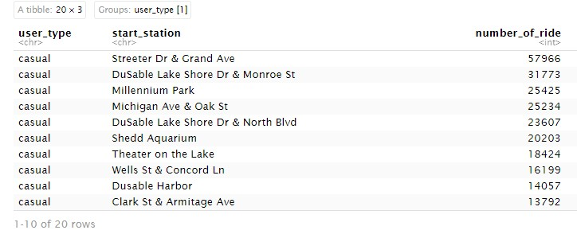

The top 5 start station names for casual riders were: 
1.  Streeter Dr & Grand Ave

2.  DuSable Lake Shore Dr & Monroe St

3.  Millennium Park

4.  Michigan Ave & Oak St

5.  DuSable Lake Shore Dr & North Blvd

#### End station names: 
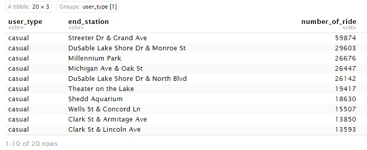

The top 5 end station names for casual riders were: 
1.  Streeter Dr & Grand Ave

2.  DuSable Lake Shore Dr & Monroe St

3.  Millennium Park

4.  Michigan Ave & Oak St

5.  DuSable Lake Shore Dr & North Blvd

### 2. Member Riders

#### Start station names
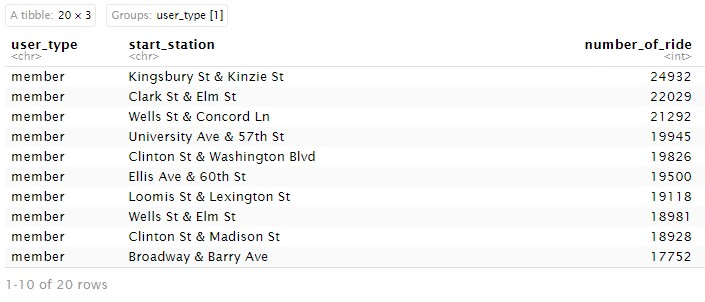

The top 5 start station names for member riders were: 
1.  Kingsbury St & Kinzie St

2.  Clark St & Elm St

3.  Wells St & Concord Ln

4.  University Ave & 57th St

5.  Clinton St & Washington Blvd

#### End station names 
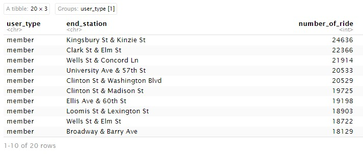

The top 5 end station names for member riders were: 
1.  Kingsbury St & Kinzie St

2.  Clark St & Elm St

3.  Wells St & Concord Ln

4.  University Ave & 57th St

5.  Clinton St & Washington Blvd

## Recommendations and Conclusions

1.  **Docked Bike Membership Plans**: Introduce cost-effective membership options specifically for docked bike users who frequently travel long distances. These plans should highlight significant cost savings compared to single-ride purchases.

2.  **Seasonal and Peak-Time Discounts**: Offer discounts on electric and docked bikes during high-demand periods, such as weekends or months with the most rides, to attract casual riders toward memberships.

3.  **Targeted Station Campaigns**: Focus marketing efforts and promotional campaigns on the most popular start and end stations for casual riders, enhancing awareness of membership benefits at these locations.

This marks the end of my Google Data Analytics Capstone.
